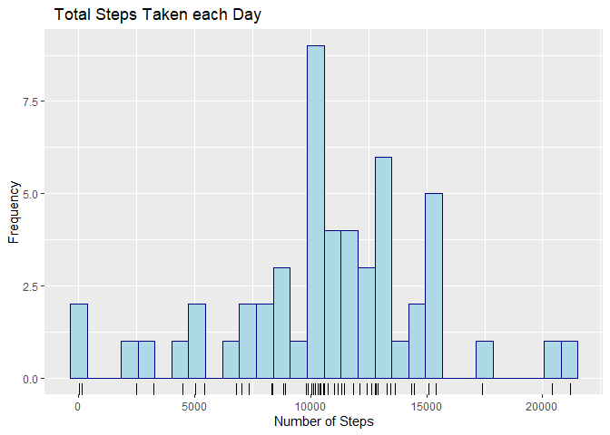
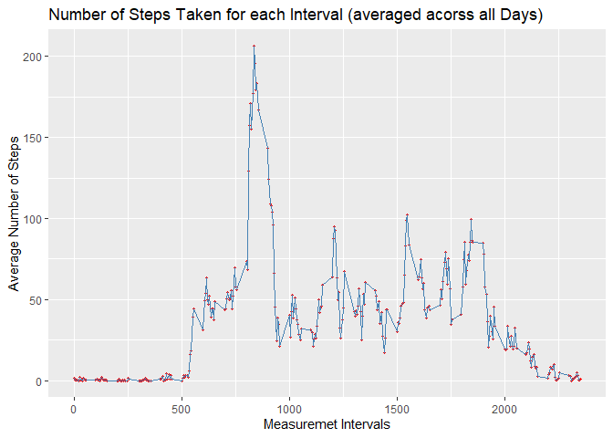
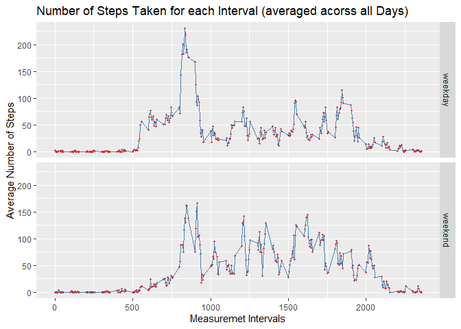

## Loading and Processing of Data

The first step this code undetakes is to check if the raw datafile activity.zip is present in the local directory.  If it cannot find the file in the local direactory it attemps to donwload the same from the followoing URL:
https://d396qusza40orc.cloudfront.net/repdata%2Fdata%2Factivity.zip

Once the file is found or downloaded, as the case may be, the file is then loaded into memory as R data frame for further processing.  

At the begining of this code, the needed library (ggplot2) for completing this assignment are also loaded. The ggplot2 library is used for producing graphs in later sections. 


```r
library(ggplot2)

localFile <- "activity.zip" 
remoteFile <- "https://d396qusza40orc.cloudfront.net/repdata%2Fdata%2Factivity.zip"

if (!file.exists(localFile)) {
  download.file(remoteFile, localFile, method="auto") 
}

activityData <- read.csv(unz("activity.zip", "activity.csv"))
```

## Mean total number of steps taken per day

### Histogram - the total number of steps taken each day

The histogram below depits of total number of steps taken each day by applying sum function for number steps grouped by each day.  


```r
sumEachDay1 <- aggregate(steps~date, data=activityData, sum, na.rm = TRUE)


ggplot(sumEachDay1, aes(x=steps))+
  geom_histogram(color="darkblue", fill="lightblue", bins = 30)+
  geom_rug()+
  labs(title = "  Total Steps Taken each Day",
       x = "Number of Steps",
       y = "Frequency")
```

<!-- -->

### The mean and median total number of steps taken per day

The code section below calculates the mean and median of the total number of steps taken per day


```r
summary(sumEachDay1$steps)[3:4]
```

```
##   Median     Mean 
## 10765.00 10766.19
```


## Average daily activity pattern

Below is the time series plot of the 5-minute interval (x-axis) and the average number of steps taken, averaged across all days (y-axis)


```r
averageEachInterval <- aggregate(steps~ interval, data=activityData, mean, na.rm=TRUE)

ggplot(averageEachInterval, aes(x=interval, y=steps, group=1)) +
  geom_point(color = "red", pch = 20)+
  geom_line(color="steelblue") +
  labs(title = "Number of Steps Taken for each Interval (averaged acorss all Days)",
       y = "Average Number of Steps",
       x = "Measuremet Intervals")
```

<!-- -->

The 5-minute interval as identified below, on an average across all the days in the dataset, contains the maximum number of steps.


```r
maxInterval <- (averageEachInterval[averageEachInterval$steps ==  max(averageEachInterval$steps), ])
knitr::kable(maxInterval, row.names = FALSE, 
             caption = "Interval with maximum number of Steps",
             table.attr = "style=\'width:30%;\'", format = "html")
```

<table style='width:30%;'>
<caption>Interval with maximum number of Steps</caption>
 <thead>
  <tr>
   <th style="text-align:right;"> interval </th>
   <th style="text-align:right;"> steps </th>
  </tr>
 </thead>
<tbody>
  <tr>
   <td style="text-align:right;"> 835 </td>
   <td style="text-align:right;"> 206.1698 </td>
  </tr>
</tbody>
</table>


## Imputing missing values

In this section we will address the rows that are without values i.e. the rows with NA values. The number of rows that do not contain NA values are as below:


```r
nrow(activityData[complete.cases(activityData),] )
```

```
## [1] 15264
```

As we can see there are around 15264 rows that do not contain the NA values. Therefore, there are total 2304 (17568-15264 = 2304)rows that do contain NA values. Let us now find out the columns where these NA values are located in order to device a strategy to impute these missing values.


```r
nrow(activityData[is.na(activityData$steps),] )
```

```
## [1] 2304
```

As we can see above, all of the NA values are appearing in 'steps' column of activityData dataframe ( 17568 - 2304 = 15264). To impute these missing value we will use the average values we have calculated above for each interval across the measurment days and stored in the variable averageEachInterval .

To impute data we have a desinged a fuction called replaceNA which maps interval with NA values in activityData dataframe with average steps calculated for the same interval and stored in averageEachInterval dataframe.  We will call replaceNA using R apply function.


```r
replaceNA <- function(x, arg2){
  if(is.na(x[1])){
    x[1] <- as.numeric(arg2[as.numeric(arg2$interval) == as.numeric(x[3]), 2], 2)
  }
  x
}

activityData <- as.data.frame(t(apply(activityData, 1, replaceNA, averageEachInterval)), 
                              stringsAsFactors = FALSE)
```


Now we have our dataframe activityData with NAs imputed with new values.  Now we will plot a histogram to ascertain the impact of imputing missing values.   


```r
sumEachDay2 <- aggregate(as.numeric(steps)~date, data=activityData, sum, na.rm = TRUE)
names(sumEachDay2) <- c("date", "steps")

 ggplot(sumEachDay2, aes(x=steps))+
   geom_histogram(color="darkblue", fill="lightblue", bins = 30)+
   geom_rug()+
   labs(title = "Histogram: Total Number of Steps Taken each Day",
        x = "Total Number of Steps Taken Each Day",
        y = "Frequency")
```

<!-- -->

It appears that 

### The mean and median 

The code section below calculates the mean and median of the total number of steps taken per day after imputing the missing values.


```r
summary(sumEachDay2$steps)[3:4]
```

```
##   Median     Mean 
## 10766.19 10766.19
```

The effect of imputing seems to be minor, it is marginally affecting the median value which is now same as the mean value. The strategy of using mean interval values for imputing missing value has minimized the impact on overall meaning of data. 


## Differences in activity patterns between weekdays and weekends

To ascertain differences in activities between weekdays and weekends we will use R weekdays funtion to map date to day name.  We will then filter out Saturday and Sunday (lördag and söndag in Swedish) and label it as a weekend/weekday in a new column called "daytype".  We will use this column to split the weekday and weekend activites while creating a plot. 


```r
activityData["daytype"] <- ifelse(grepl("lör|sön", 
                                        weekdays(as.Date(activityData$date, "%Y-%m-%d"))),
                                  "weekend", "weekday")

activityData$steps <- as.numeric(activityData$steps)
averageEachInterval2 <- aggregate(steps ~ interval + daytype, 
                                  data=activityData, mean, na.rm=TRUE)
```

Below is the plot comparing the activities between weekdays and weekends. 


```r
 ggplot(averageEachInterval2, aes(x=as.numeric(interval), y=steps, group=1)) +
   geom_point(color = "red", pch = 20)+
   geom_line(color="steelblue") +
   labs(title = "Number of Steps Taken for each Interval (averaged acorss all Days)",
        y = "Average Number of Steps",
        x = "Measuremet Intervals") +
   facet_grid(daytype~.) 
```

<!-- -->

