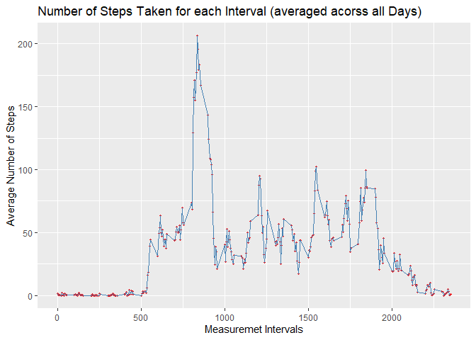
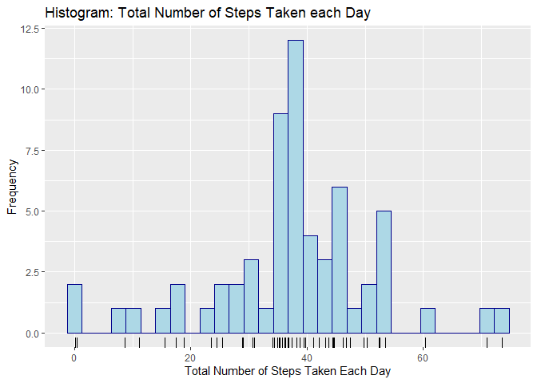
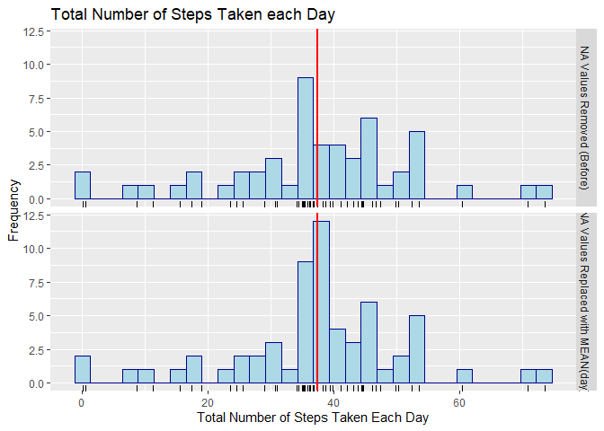

```r
library(ggplot2)

localFile <- "activity.zip" 
remoteFile <- "https://d396qusza40orc.cloudfront.net/repdata%2Fdata%2Factivity.zip"
  
if (!file.exists(localFile)) {
  download.file(remoteFile, localFile, method="auto") 
}

activityData <- read.csv(unz("activity.zip", "activity.csv"))
```


## What is mean total number of steps taken per day?


```r
meanEachDay1 <- aggregate(steps~date, data=activityData, mean, na.rm = TRUE)

ggplot(meanEachDay1, aes(x=steps))+
  geom_histogram(color="darkblue", fill="lightblue")+
  geom_rug()+
  labs(title = "Histogram: Total Number of Steps Taken each Day",
       x = "Total Number of Steps Taken Each Day",
       y = "Frequency")
```

```
## `stat_bin()` using `bins = 30`. Pick better value with `binwidth`.
```

<!-- -->

```r
summary(meanEachDay1$steps)[4:3]
```

```
##     Mean   Median 
## 37.38260 37.37847
```
## What is the average daily activity pattern?


```r
averageEachInterval <- aggregate(steps~ interval, data=activityData, mean, na.rm=TRUE)

ggplot(averageEachInterval, aes(x=interval, y=steps, group=1)) +
  geom_point(color = "red", pch = 20)+
  geom_line(color="steelblue") +
  labs(title = "Number of Steps Taken for each Interval (averaged acorss all Days)",
       y = "Average Number of Steps",
       x = "Measuremet Intervals")
```

<!-- -->

## Imputing missing values


```r
replaceNA <- function(x, arg2){
  if(is.na(x[1])){
    x[1] <- as.numeric(arg2[as.numeric(arg2$interval) == as.numeric(x[3]), 2], 2)
  }
  x
}

activityData <- as.data.frame(t(apply(activityData, 1, replaceNA, averageEachInterval)), 
                              stringsAsFactors = FALSE)
```


```r
meanEachDay2 <- aggregate(as.numeric(steps)~date, data=activityData, mean, na.rm = TRUE)
names(meanEachDay2) <- c("date", "steps")

 ggplot(meanEachDay2, aes(x=steps))+
   geom_histogram(color="darkblue", fill="lightblue")+
   geom_rug()+
   labs(title = "Histogram: Total Number of Steps Taken each Day",
        x = "Total Number of Steps Taken Each Day",
        y = "Frequency")
```

```
## `stat_bin()` using `bins = 30`. Pick better value with `binwidth`.
```

<!-- -->

```r
summary(meanEachDay2$steps)[4:3]
```

```
##    Mean  Median 
## 37.3826 37.3826
```


#Comparison before and after


```r
meanEachDay1["version"] <- "NA Values Removed (Before)"
meanEachDay2["version"] <- "NA Values Replaced with MEAN(day)"
meanEachDay <- rbind(meanEachDay1, meanEachDay2)

ggplot(meanEachDay, aes(x=steps), bins=60)+
  geom_histogram(color="darkblue", fill="lightblue")+
  geom_rug()+
  labs(title = "Total Number of Steps Taken each Day",
       x = "Total Number of Steps Taken Each Day",
       y = "Frequency")+
  facet_grid(version~.)+
  geom_vline(aes(xintercept = mean(steps)),col='red',size=1)
```

```
## `stat_bin()` using `bins = 30`. Pick better value with `binwidth`.
```

<!-- -->

## Are there differences in activity patterns between weekdays and weekends?


```r
activityData["daytype"] <- ifelse(grepl("lör|sön", weekdays(as.Date(activityData$date, "%Y-%m-%d"))), "weekend", "weekday")
activityData$steps <- as.numeric(activityData$steps)

averageEachInterval <- aggregate(steps ~ interval + daytype, data=activityData, mean, na.rm=TRUE)
nrow(averageEachInterval)
```

```
## [1] 576
```

```r
head(averageEachInterval)
```

```
##   interval daytype      steps
## 1        0 weekday 2.25115304
## 2        5 weekday 0.44528302
## 3       10 weekday 0.17316562
## 4       15 weekday 0.19790356
## 5       20 weekday 0.09895178
## 6       25 weekday 1.59035639
```

```r
 ggplot(averageEachInterval, aes(x=as.numeric(interval), y=steps, group=1)) +
   geom_point(color = "red", pch = 20)+
   geom_line(color="steelblue") +
   labs(title = "Number of Steps Taken for each Interval (averaged acorss all Days)",
        y = "Average Number of Steps",
        x = "Measuremet Intervals") +
   facet_grid(daytype~.) 
```

<!-- -->

